```{r setup, include=FALSE}
knitr::opts_chunk$set(echo = TRUE)
```
## Background

Motivated by ecological communities to develop tools for  multi-dimensional time series


```{r, out.width = "800px", fig.align = "center", fig.cap = "Collage of rodent species from the Portal Project; https://portal.naturecast.org/profiles.html", echo = FALSE}
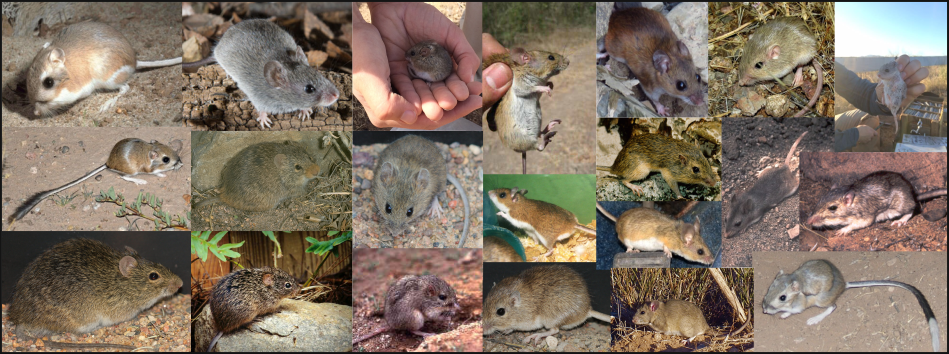
```

## Background

Motivated by ecological communities to develop tools for  multi-dimensional time series


```{r, out.width = "800px", fig.align = "center", fig.cap = "Time series of rodent populations", echo = FALSE}
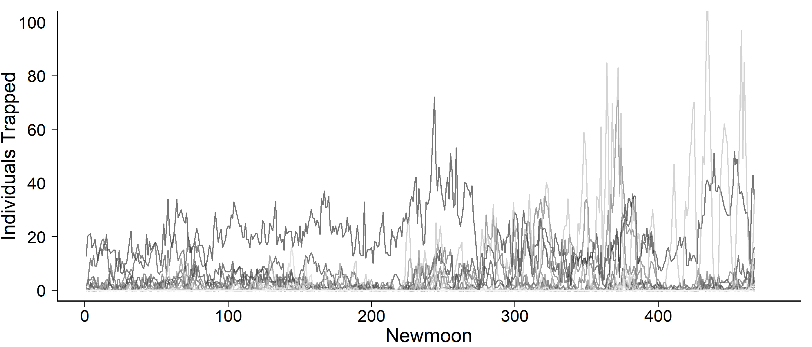
```

## Background

Motivated by ecological communities to develop tools for  multi-dimensional time series


```{r, out.width = "800px", fig.align = "center", fig.cap = "Time series of rodent populations with putative qualitative changes noted", echo = FALSE}
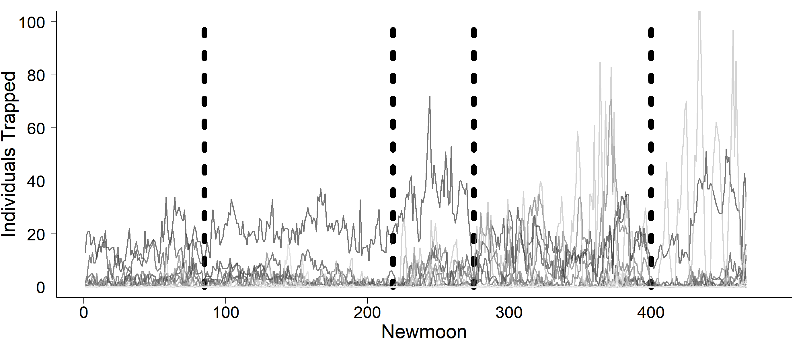
```


## Background

Quantify how ecosystems are responding to stressors

<div class="columns-2">
<div class="build">
* Climate change
* Invasive species
* Landscape alteration


```{r, out.width = "400px", fig.align = "center", fig.cap = "Phase plane of precipitation and temperature at Portal over time", echo = FALSE}
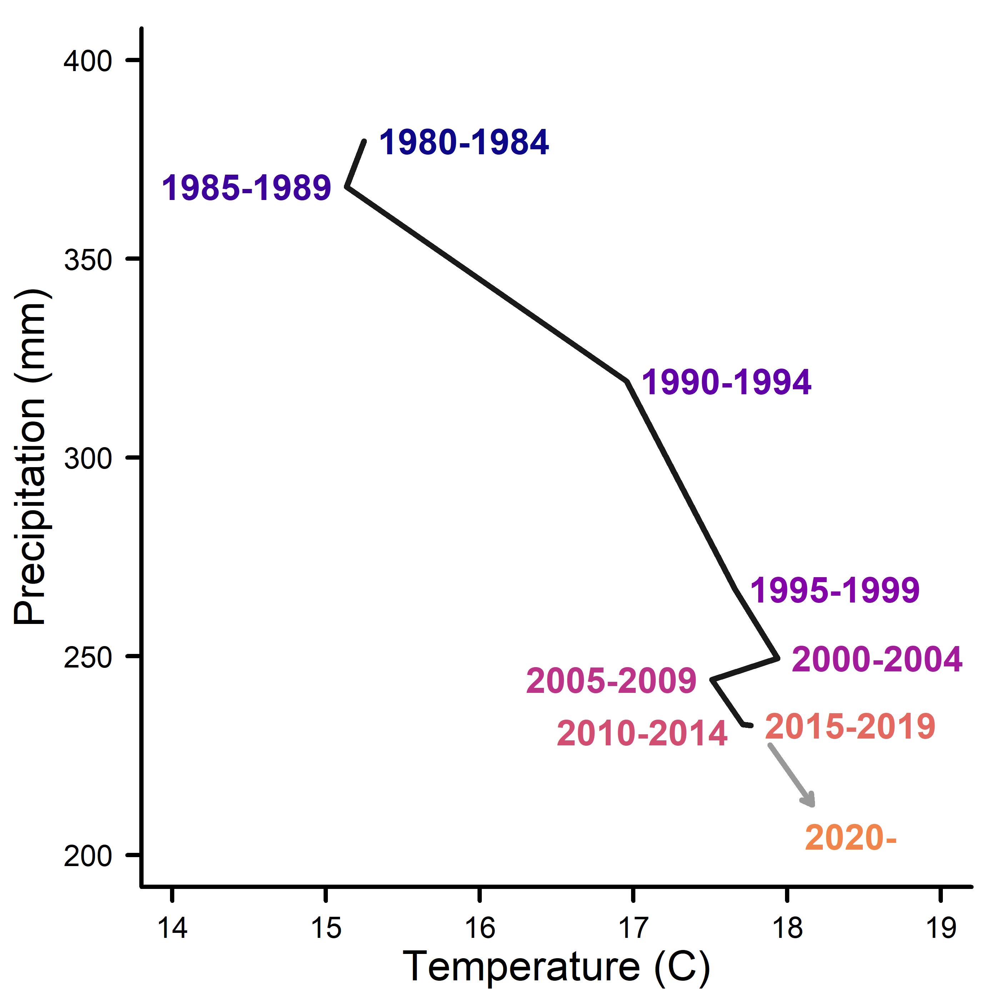
```
</div>
</div>

## Background

Need to distinguish among dynamics
<div class="columns-2">

<br>
<div class="build">
* Stochasticity
* Autocorrelation
* Cyclical dynamics
* Gradual change
* Abrupt shifts
</div>

<br>
```{r, out.width = "450px", fig.align = "right", fig.cap = "Time series of rodent populations zoomed in to moons 200 to 400", echo = FALSE}
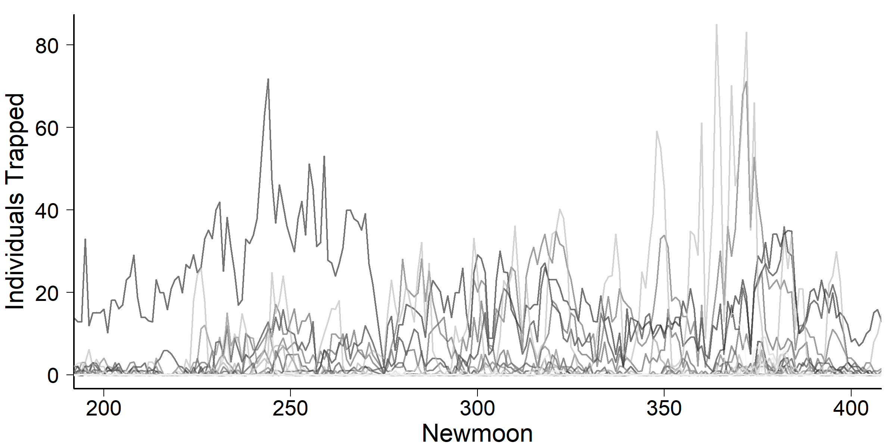
```

</div>

## Background

```{r, out.width = "800px", fig.align = "center", fig.cap = "Title of Christensen et al 2018 Ecology Report", echo = FALSE}
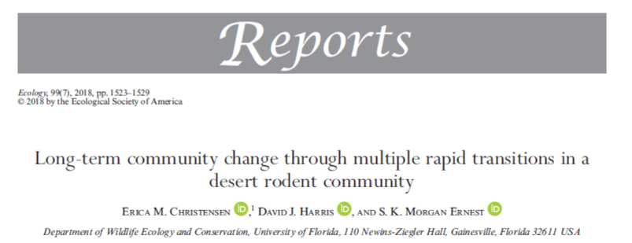
```

<br>
[Christensen et al. 2018](https://esajournals.onlinelibrary.wiley.com/doi/full/10.1002/ecy.2373) established methods

## Background

LDATS: **L**atent **D**irichlet **A**llocation coupled with **T**ime **S**eries analyses

<br>
[Christensen et al. 2018](https://esajournals.onlinelibrary.wiley.com/doi/full/10.1002/ecy.2373) established methods

## Background (coming soon!)

LDATS: **L**inguistic **D**ecomposition **A**lgorithms coupled with **T**ime **S**eries analyses

<br>
[Christensen et al. 2018](https://esajournals.onlinelibrary.wiley.com/doi/full/10.1002/ecy.2373) established methods


## Goals for LDATS Package 

<div class="build">
* Standardize, Generalize, Optimize [Christensen et al. 2018](https://esajournals.onlinelibrary.wiley.com/doi/full/10.1002/ecy.2373) methodology
* `lm`-style analysis API

```{r, out.width = "500px", fig.align = "center", fig.cap = "Digital painting of horses coming out from under the hood of a truck; https://www.deviantart.com/sesroh/art/235-Horses-Under-The-Hood-52286525", echo = FALSE}
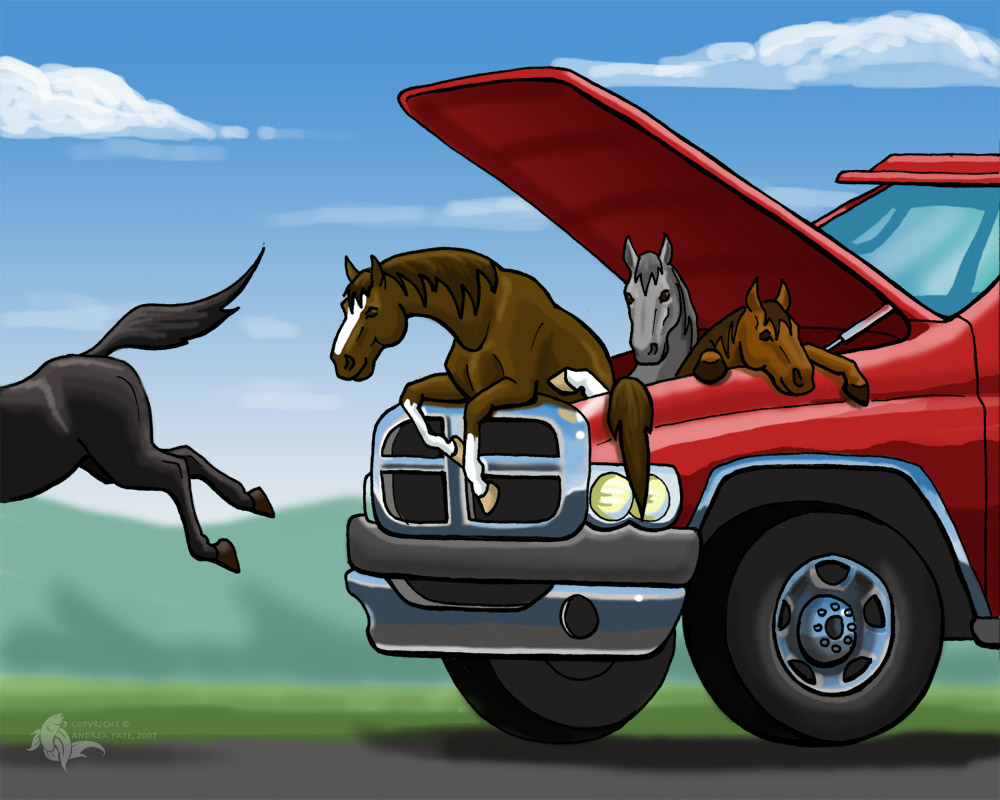
```
</div>


## Goals for LDATS Package 


<div style="font-size: 22pt">
`
LDA_TS(data, topics = 2, replicates = 1, formulas = ~1, nchangepoints = 0, 
    timename = "time", weights = TRUE, control = list())
`

```{r, out.width = "1000px", fig.align = "center", fig.cap = "Screencap of LDATS on CRAN; https://cran.r-project.org/web/packages/LDATS/index.html", echo = FALSE}
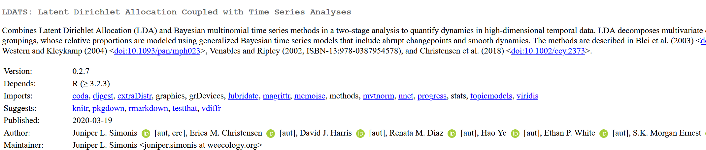
```
</div>


## Statistical Approach

Two-stage analyses:

<div class="build">
1. Reduce dimensions  
2. Analyze time series from [1]
</div>

## Dimension Reduction 
Latent Dirichlet Allocation

<div class="columns-2" style="font-size: 22pt">
<div class="build">
$M$ total documents  
$N$ total words  
$w$ term identity  
$z$ topic identity  
$\theta$ topics-in-documents   
$\alpha$ Dirichlet parameter for $\theta$  
$\beta$ terms-in-topics  
</div>

```{r, out.width = "400px", fig.align = "center", fig.cap = "Plate notation for Latent Dirichlet Allocation", echo = FALSE}
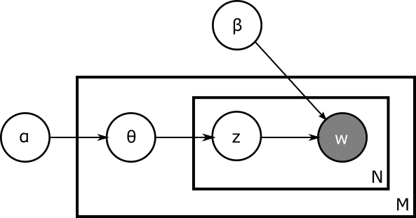
```

&nbsp;
&nbsp;
```{r, out.width = "250px", fig.align = "right", fig.cap = "Bookshelf", echo = FALSE}
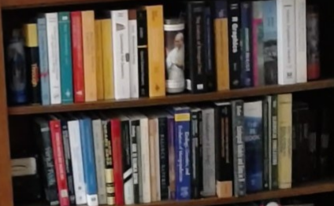
```
</div>


## Dimension Reduction 
Latent Dirichlet Allocation

```{r, out.width = "600px", fig.align = "center", fig.cap = "Matrix decomposition representation of LDA", echo = FALSE}

```

&nbsp;
```{r, out.width = "250px", fig.align = "center", fig.cap = "Bookshelf", echo = FALSE}

```

## Dimension Reduction 
Latent Dirichlet Allocation

```{r, out.width = "600px", fig.align = "center", fig.cap = "Matrix decomposition representation of LDA with ecological terms", echo = FALSE}

```
  
&nbsp;
```{r, out.width = "400px", fig.align = "center", fig.cap = "Collage of rodent species from the Portal Project; https://portal.naturecast.org/profiles.html", echo = FALSE}

```

## Dimension Reduction 
Latent Dirichlet Allocation

```{r, out.width = "600px", fig.align = "center", fig.cap = "Matrix decomposition representation of LDA with ecological terms and Gamma bolded", echo = FALSE}

```
  
&nbsp;
```{r, out.width = "400px", fig.align = "center", fig.cap = "Collage of rodent species from the Portal Project; https://portal.naturecast.org/profiles.html", echo = FALSE}

```


## Time Series

Multivariate response with a suite of possible dynamics

<div class="build">
```{r, out.width = "500px", fig.align = "center", fig.cap = "Time series of LDA decomposed rodent data", echo = FALSE}
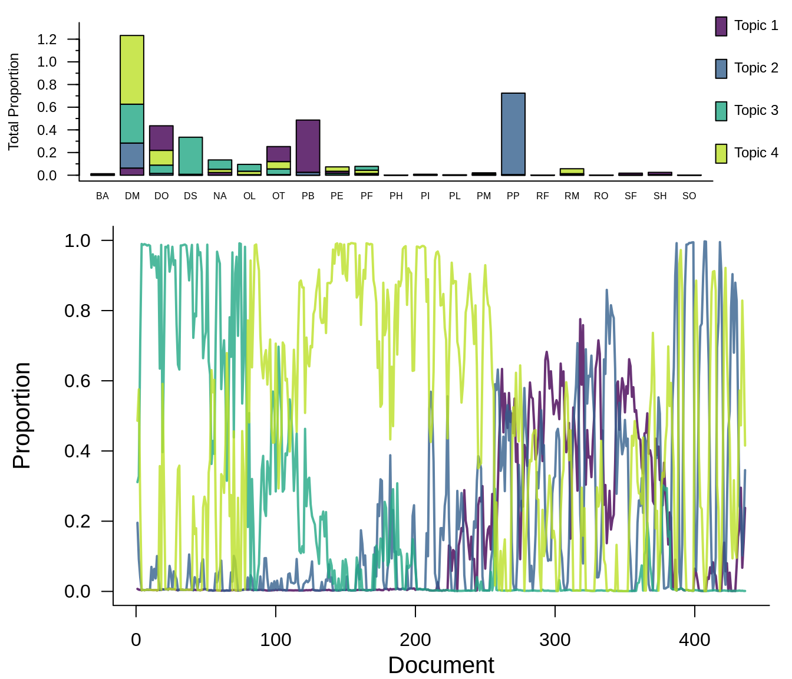
```
</div>

## Time Series

Multivariate response 

<div class="build">
<div>
Softmax-based regression via `nnet`

&nbsp;
$$S(y_i) = \frac{e^y_i}{\sum_je^y_j}$$
</div>
</div>

## Time Series (coming soon!)

Multivariate response 

<div class="build">
<div>
Simplex-based regression via `compositions`

&nbsp;
$$\mathrm{ILR}(y_i) = \sqrt{\frac{i}{i+1}}\mathrm{ln}(\frac{\overline{\mathbf{x}}}{x_{i+1}}) $$ 
</div>
</div>


## Time Series

Bayesian Change Point Indicator Regression

<div class="build">
```{r, out.width = "600px", fig.align = "center", fig.cap = "Change Point time series from Ruggieri paper showing application of multi-change point model to NOAA temperature anomaly data", echo = FALSE}
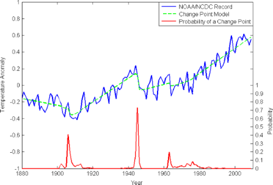
```
</div>

## Time Series

Bayesian Change Point Indicator Regression

<div class="build">
* 0, 1, ... change points
* varying dynamics between change points
</div>

```{r, out.width = "500px", fig.align = "center", fig.cap = "Time series of LDA decomposed rodent data", echo = FALSE}
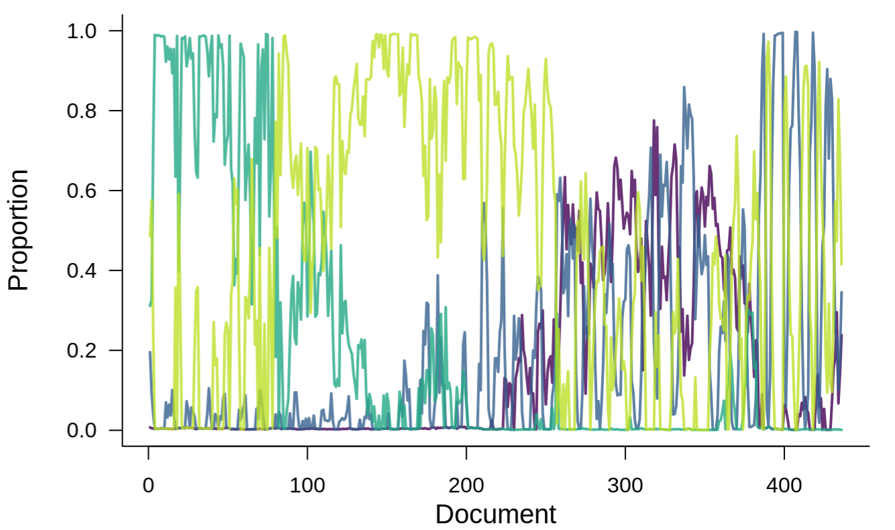
```


## Time Series

Sequential fitting:

<div class="build">
1. Posterior probability of change points, unconditional on regressors
    - produces estimates of regressors conditional on change points
2. De-condition posterior probabilities of regressors given uncertain change points
</div>


## Time Series

```{r, out.width = "600px", fig.align = "center", fig.cap = "Time series of LDA decomposed rodent data analyzed using the time series model, with change points and fitted dynamics shown", echo = FALSE}
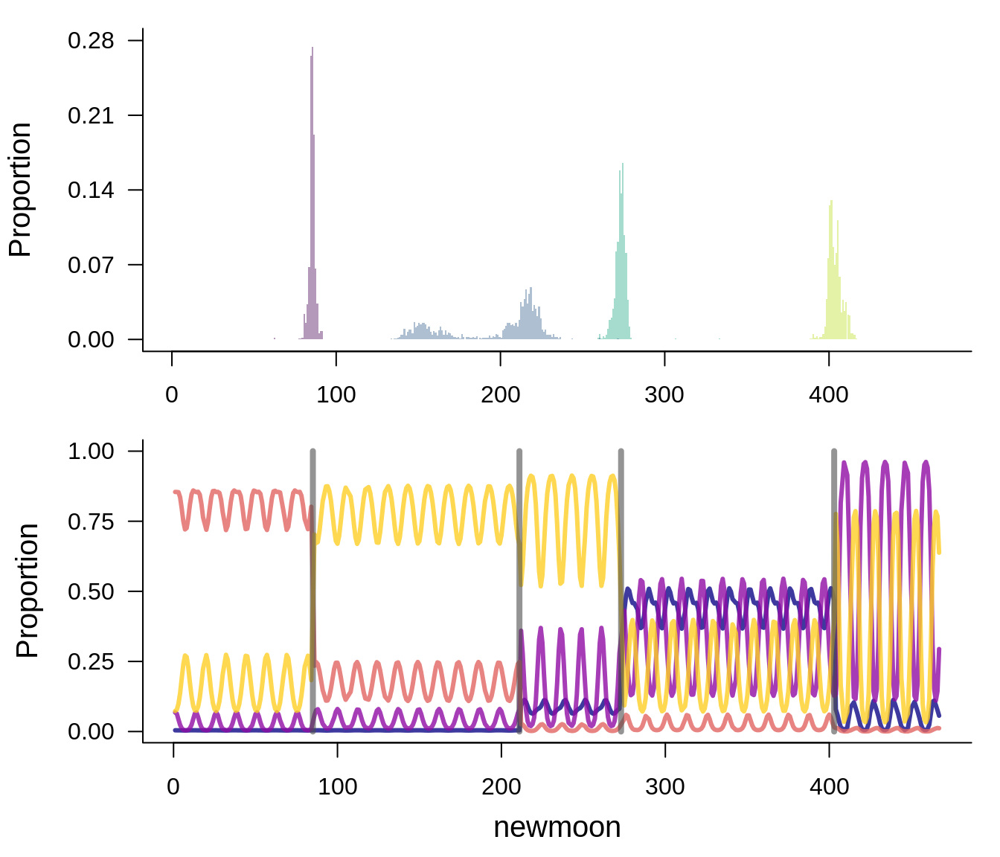
```


## Time Series

Estimation via parallel tempering Markov Chain Monte Carlo (ptMCMC) over the top of multinomial regression

<div class="columns-2">
<div class ="build">
```{r, out.width = "400px", fig.align = "center", fig.cap = "Figure 1 from Earl and Deem 2005 showing a 2-D representation of a phase space for which ptMCMC is useful", echo = FALSE}
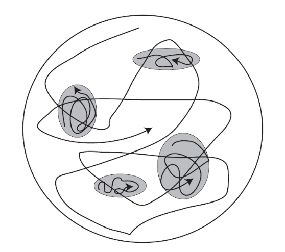
```

```{r, out.width = "500px", fig.align = "center", fig.cap = "Figure 2 from Earl and Deem 2005, a schematic of parallel tempering chains with swapping", echo = FALSE}
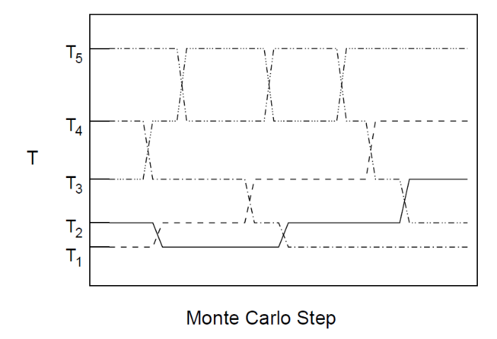
```
</div>
</div>

## Time Series

Estimation via parallel tempering Markov Chain Monte Carlo (ptMCMC) over the top of multinomial regression

Coded internally in `LDATS` functions

```{r, out.width = "500px", fig.align = "center", fig.cap = "Digital painting of horses coming out from under the hood of a truck; https://www.deviantart.com/sesroh/art/235-Horses-Under-The-Hood-52286525", echo = FALSE}

```


## `LDATS` Package {.build}

Top-level API:


<div style="font-size: 22pt">
`
LDA_TS(data, topics = 2, nseeds = 1, formulas = ~1, nchangepoints = 0, 
    timename = "time", weights = TRUE, control = list())
`
</div>


Multi-model friendly  
  
Down-and-dirty details in `control` lists


## `LDATS` Package (coming soon!)

Top-level API v0.3.0:

<div style="font-size: 22pt">
`
LDA_TS(data, topics = 2, replicates = 1, formulas = ~1, nchangepoints = 0, 
    timename = "time", weights = TRUE, control = list())
`
</div>

Multi-model friendly  
  
Down-and-dirty details in `control` lists


## `LDATS` Package

Vignettes 

  - show full application
  - compare package to [Christensen et al. 2018](https://esajournals.onlinelibrary.wiley.com/doi/full/10.1002/ecy.2373)
  - detail codebase

[Package website](https://weecology.github.io/LDATS) 


## `LDATS` Package

Internally-conducted summaries

<div class = "build" style="font-size: 22pt">
`
ldats <- LDA_TS(data)
`

`
ldats[["Selected TS model"]][["rho_summary"]]
`

<div style="font-size: 12pt">


```{r rho_summary, echo = FALSE}

x <- c(Mean = 209.3, Median = 211, Mode = 215, Lower95 = 190, Upper95 = 225, SD = 9.7, MCMCerr = 0.307, AC10 = 0.010, ESS = 380.35)
x1 <- data.frame(matrix(x, nrow = 1))
colnames(x1) <- names(x)
knitr::kable(x1, format = "html", caption = 'Changepoint ptMCMC summary table')
```
</div>
</div>


## `LDATS` Package

Internally-conducted summaries

<div style="font-size: 22pt">
`
ldats <- LDA_TS(data)
`

`
ldats[["Selected TS model"]][["eta_summary"]]
`
</div>

## `LDATS` Package


<div style="font-size: 10pt">

```{r eta_summary, echo = FALSE}
x <- read.csv("data/eta.csv")
colnames(x)[1] <- ""
knitr::kable(x, format = "html", caption = 'Regressor ptMCMC summary table')
```
</div>


## `LDATS` Package

Plotting functionality

<div style="font-size: 22pt">
`
ldats <- LDA_TS(data)
`

`
plot(ldats)
`
</div>


## `LDATS` Package

<div class="columns-2">
```{r, out.width = "500px", fig.align = "center", fig.cap = "Time series of LDA decomposed rodent data", echo = FALSE}
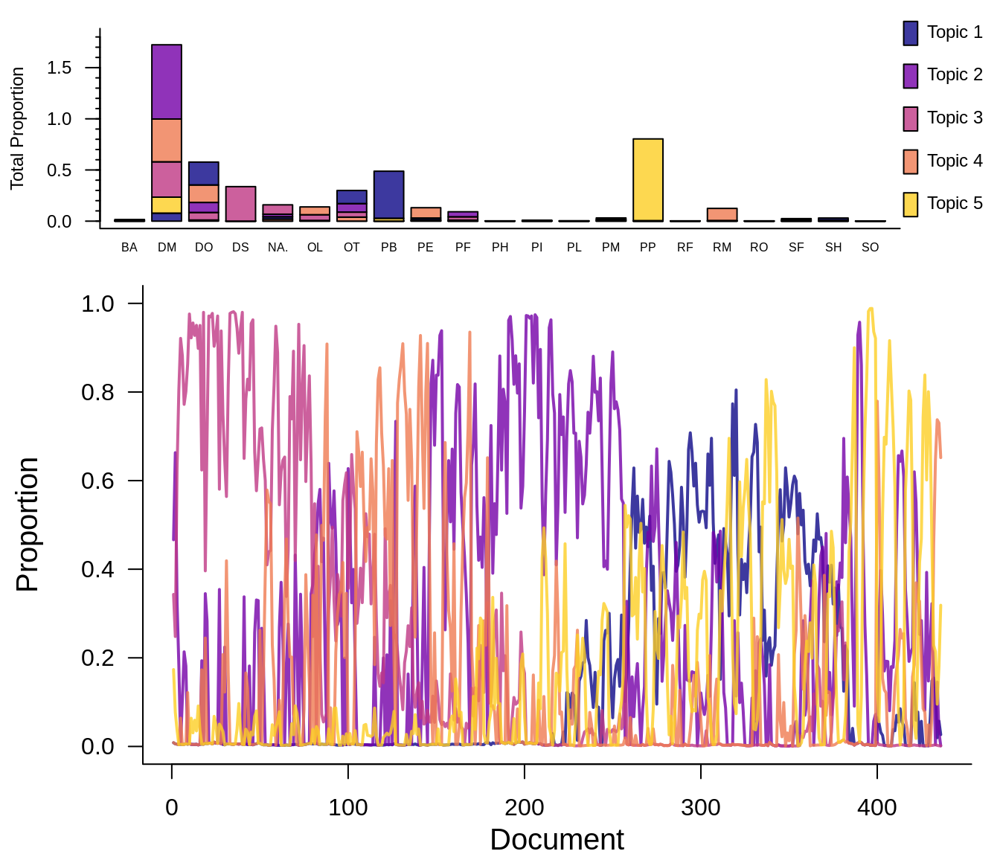
```

```{r, out.width = "500px", fig.align = "center", fig.cap = "Time series of LDA decomposed rodent data analyzed using the time series model, with change points and fitted dynamics shown", echo = FALSE}
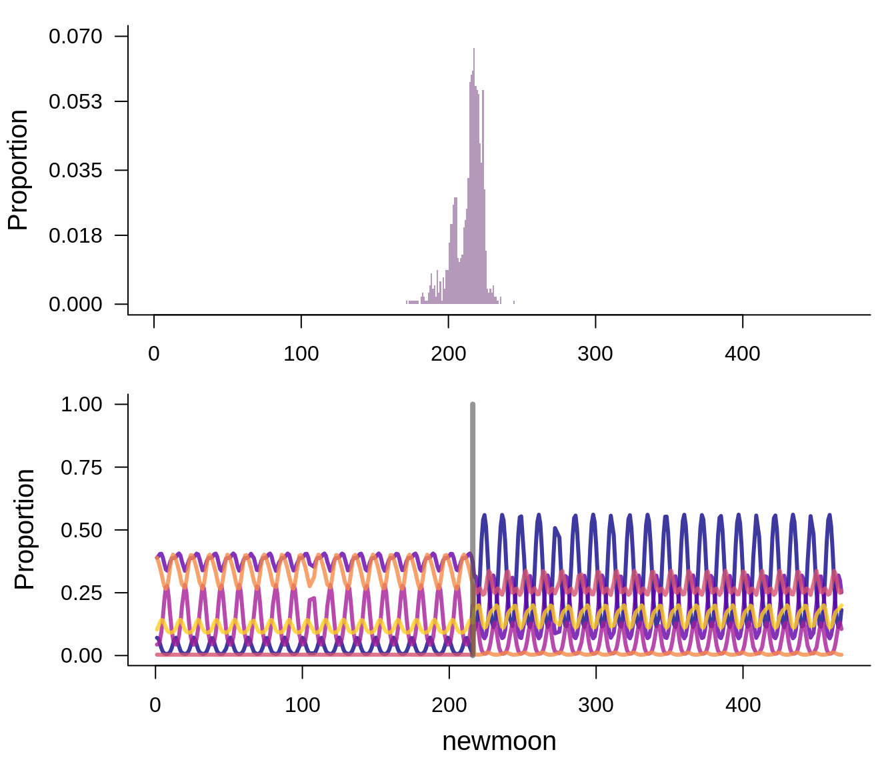
```
</div>


## `LDATS` Package

<div class ="build">
- v0.2.7
  - [Released on CRAN](https://cran.r-project.org/package=LDATS)

```{r, out.width = "800px", fig.align = "center", fig.cap = "Development status badges for LDATS", echo = FALSE}
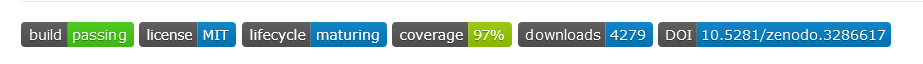
```

- v0.3.0
  - [In development on GitHub](https://github.com/weecology/LDATS/pull/152)
</div>


## `LDATS` Package

- [Work In Progress v0.3.0](https://github.com/weecology/LDATS/pull/152)

- `simulate`
- `predict`
- flexible model selection methods
  - hold out & cross-validation

## Application

Context: [Macro-ecological Analyses of Time Series Structure (MATSS)](https://github.com/weecology/MATSS)

[MATSS LDATS](https://github.com/weecology/MATSS-LDATS)

Leverage a massive compendium of ecological time series to evaluate the presence of, e.g., regime shifts


## Application

```{r, out.width = "850px", fig.align = "center", fig.cap = "Results of LDATS analyses for many ecological communities", echo = FALSE}
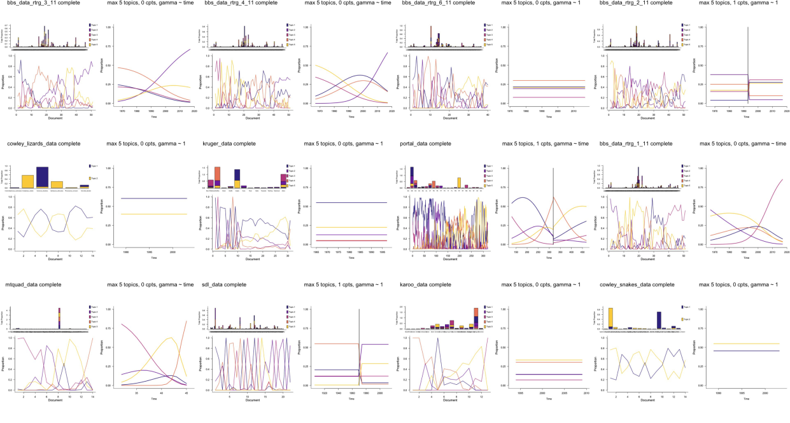
```


## Interested?

We welcome collaborators and contributors!

[Christensen et al. 2018](https://esajournals.onlinelibrary.wiley.com/doi/full/10.1002/ecy.2373)


[CRAN](https://cran.r-project.org/package=LDATS)


[Github](https://github.com/weecology/LDATS)  
  - [Guidlines for contributors](https://github.com/weecology/LDATS/blob/master/CONTRIBUTING.md)  
  - [License](https://github.com/weecology/LDATS/blob/master/LICENSE.md)  

## Acknowledgements

### **Funding** 

National Science Foundation: DEB-1622425, DGE-1315138, DGE-1842473

Gordon and Betty Moore Foundation: Data-Driven Discovery Initiative Grant GBMF4563 

```{r logos, width = "600px", echo=FALSE, fig.cap="Weecology, DAPPER Stats, and UF logos"}
knitr::include_graphics("img/logo.png")
```