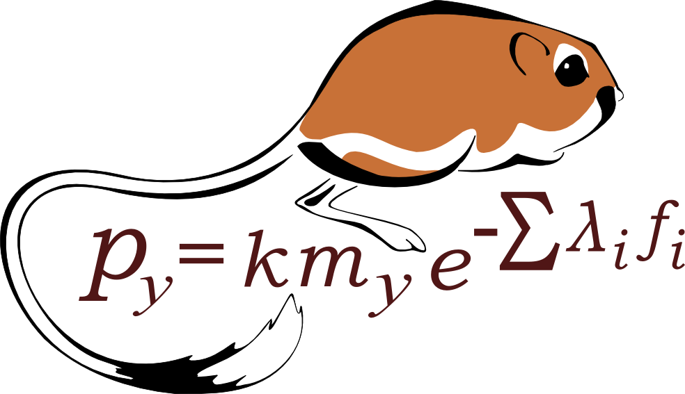

```{r setup, include=FALSE}
knitr::opts_chunk$set(echo = TRUE)
```
## Background

Motivated by ecological communities to develop tools for  multi-dimensional time series


```{r, out.width = "700px", fig.align = "center", fig.cap = "Collage of rodent species from the Portal Project; https://portal.naturecast.org/profiles.html", echo = FALSE}
knitr::include_graphics("img/rodent_collage.png")
```

## Background

Motivated by ecological communities to develop tools for  multi-dimensional time series


```{r, out.width = "700px", fig.align = "center", fig.cap = "Time series of rodent populations", echo = FALSE}
knitr::include_graphics("img/time_series_full.png")
```

## Background

Motivated by ecological communities to develop tools for  multi-dimensional time series


```{r, out.width = "700px", fig.align = "center", fig.cap = "Time series of rodent populations with putative qualitative changes noted", echo = FALSE}
knitr::include_graphics("img/time_series_full_verts.png")
```


## Background

Quantify how ecosystems are responding to stressors

<div class="columns-2">
* Climate change
* Invasive species
* Landscape alteration

<br>
```{r, out.width = "325px", fig.align = "center", fig.cap = "Phase plane of precipitation and temperature at Portal over time", echo = FALSE}
knitr::include_graphics("img/climatefig.png")
```
</div>

## Background

<div class="columns-2">

Need to distinguish

* Stochasticity
* Autocorrelation
* Cyclical dynamics
* Gradual change
* Abrupt shifts

<br>
```{r, out.width = "400px", fig.align = "right", fig.cap = "Time series of rodent populations zoomed in to moons 200 to 400", echo = FALSE}
knitr::include_graphics("img/time_series.png")
```

</div>

## Background

```{r, out.width = "800px", fig.align = "center", fig.cap = "Title of Christensen et al 2018 Ecology Report", echo = FALSE}
knitr::include_graphics("img/christensen_etal_title.png")
```

<br>
[Christensen et al. 2018](https://esajournals.onlinelibrary.wiley.com/doi/full/10.1002/ecy.2373) established methods

## Goals for LDATS Package

* Standardize
* Generalize


## Statistical Approach


## Dimension Reduction

Latent Dirichlet Allocation


## Time Series

Abrupt change points

Fit using parallel tempering MCMC

## ptMCMC


## `LDATS` Package

Top-level API target: an "`lm`-style"

`
LDA_TS(data, topics = 2, nseeds = 1, formulas = ~1, nchangepoints = 0, 
    timename = "time", weights = TRUE, control = list())
`

## `LDATS` Package

Under-the-hood


## `LDATS` Package

### LDATS v0.2.7

Released on CRAN

## `LDATS` Package

### LDATS v0.3.0

In development on GitHub

## eh

```{r uf, echo=FALSE, fig.cap="A caption", out.width = '20%'}

```

## Acknowledgements

### Funding 

National Science Foundation: DEB-1622425, DGE-1315138, DGE-1842473

Gordon and Betty Moore Foundation: Data-Driven Discovery Initiative Grant GBMF4563 



